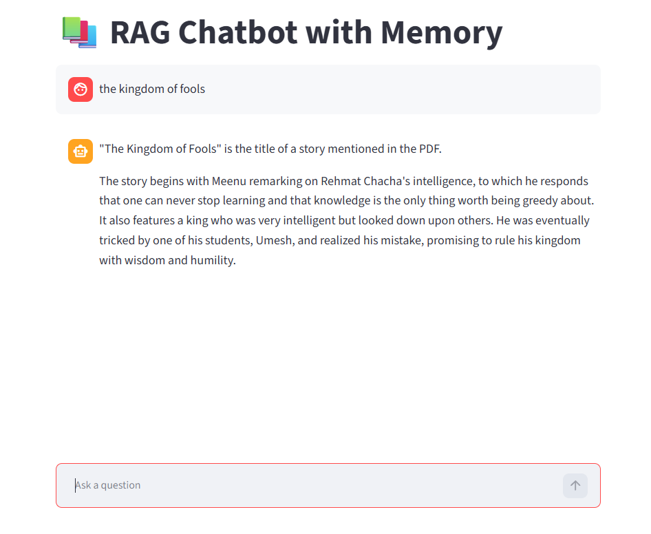

# 🤖 RAG Chatbot with Memory

A Retrieval-Augmented Generation (RAG) chatbot built using **LangChain**, **Google Gemini**, **FAISS**, and **Streamlit**. The chatbot answers questions from PDF documents while maintaining conversation memory.

## 🚀 Features

* PDF document processing
* Semantic search using FAISS
* Conversation memory
* Google Gemini integration
* Fast document retrieval
* Streamlit web interface

## 🛠️ Tech Stack

* Python
* Streamlit
* LangChain
* Google Gemini
* FAISS
* PyPDFLoader

## 📸 Screenshot



## ⚙️ Installation

```bash
git clone https://github.com/Nehanayar/Rag-chatbot-with-memory.git
cd Rag-chatbot-with-memory

pip install -r requirements.txt

streamlit run chatbot.py
```

## 🔑 Environment Variables

Create a `.env` file:

```env
GEMINI_API_KEY=your_api_key_here
```

## 📂 Project Structure

```text
Rag-chatbot-with-memory/
├── main.py
├── mybot.py
├── requirements.txt
├── sample.pdf
├── screenshot/
│   └── rag1.png
├── README.md
└── LICENSE
```

## 📜 License

MIT License

## 👩‍💻 Author

Neha Nayar
